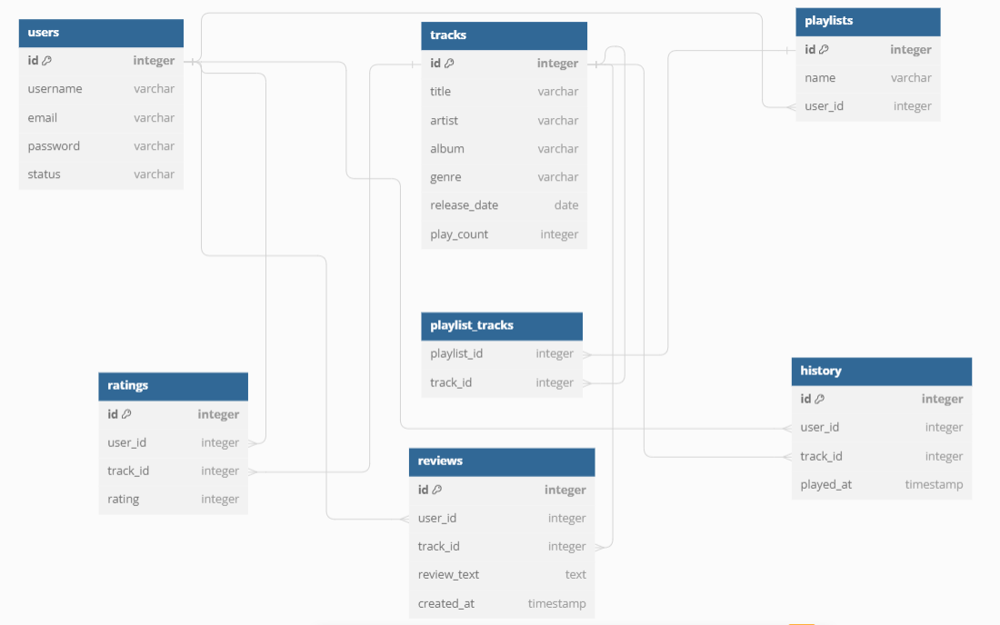

# CourseProject_Spring
## Веб-застосунок для пошуку та прослуховування музики
### Функціональні вимоги

  - Як користувач, я хочу мати можливість переглядати головну сторінку з популярною та рекомендованою музикою
  - Як користувач, я хочу мати можливість переглядати сторінку з інформацією про конкретний музичний трек
  - Як користувач, я хочу мати можливість шукати музичні треки за назвою
  - Як користувач, я хочу мати можливість шукати музичні треки за ім'ям виконавця
  - Як користувач, я хочу мати можливість шукати музичні треки за назвою альбому
  - Як користувач, я хочу мати можливість шукати музичні треки за жанром
  - Як користувач, я хочу мати можливість шукати музичні треки за датою випуску
  - Як користувач, я хочу мати можливість оцінювати музичні треки
  - Як користувач, я хочу мати можливість створювати та видаляти свої плейлисти
  - Як користувач, я хочу мати можливість переглядати вміст мого плейлисту
  - Як користувач, я хочу мати можливість щукати плейлисти за назвою
  - Як користувач, я хочу мати можливість додавати та видаляти музичні треки з моїх плейлистів
  - Як користувач, я хочу мати можливість прослуховувати музичні треки
  - Як користувач, я хочу отримувати рекомендації на основі моїх вподобань та історії прослуховувань
  - Як адміністратор, я хочу мати можливість додавати нові музичні треки до бази даних
  - Як адміністратор, я хочу мати можливість змінювати інформацію про музичні треки
  - Як адміністратор, я хочу мати можливість видаляти музичні треки з бази даних
  - Як адміністратор, я хочу мати можливість керувати акаунтами користувачів(блокувати, видаляти акаунти)
  - Як адміністратор, я хочу мати можливість переглядати статистику використання веб-застосунку(кількість прослуховувань, популярні треки)
  - Як адміністратор, я хочу мати можливість модерації відгуків та оцінок залишених користувачами

### Поведінка системи

1. Управління користувачами
   - Реєстрація нового облікового запису користувача
   - Вхід користувача
   - Вихід користувача
2. Інформація про музику
   - Отримання детальної інформації про конкретний музичний трек
   - Пошук музичних треків за назвою, виконавцем, альбомом, жанром або датою випуску
   - Перегляд списку популярних та рекомендованих музичних треків
3. Плейлисти користувачів
   - Створення нового плейлиста
   - Видалення плейлиста
   - Перегляд вмісту плейлиста
   - Пошук плейлистів за назвою
   - Додавання треків до плейлиста
   - Видалення треків з плейлиста
4. Оцінки та відгуки
   - Оцінювання музичного треку
   - Створення відгуку про музичний трек
   - Оновлення існуючого відгуку
   - Видалення відгуку
   - Читання відгуків про конкретний музичний трек
5. Просолуховування та рекомендації
   - Прослуховування музичного треку
   - Перегляд історії прослуховувань
   - Отримання музичних рекомендацій
6. Адміністрування
   - Додавання нового музичного треку
   - Редагування інформації про музичний трек
   - Видалення музичного треку
   - Управління обліковими записами користувачів
   - Перегляд статистики використання
   - Модерація відгуків та оцінок

### REST API endpoints

1. Реєстрація, авторизація та вихід користувачів
    - `POST /api/auth/register` - Реєстрація нового користувача
    - `POST /api/auth/login` - Вхід користувача до системи
    - `POST /api/auth/logout` - Вихід користувача з системи

2. Функціонал для користувача
    - `GET /api/home` - Перегляд головної сторінки з популярною та рекомендованою музикою
    - `GET /api/tracks/{track_id}` - Отримання інформації про конкретний музичний трек
    - `GET /api/tracks/search?name={name}` - Пошук музичних треків за назвою
    - `GET /api/tracks/search?artist={artist}` - Пошук музичних треків за ім'ям виконавця
    - `GET /api/tracks/search?album={album}` - Пошук музичних треків за назвою альбому
    - `GET /api/tracks/search?genre={genre}` - Пошук музичних треків за жанром
    - `GET /api/tracks/search?release_date={release_date}` - Пошук музичних треків за датою випуску
    - `POST /api/tracks/{track_id}/rate` - Оцінювання музичного треку
    - `POST /api/playlists` - Створення нового плейлиста
    - `DELETE /api/playlists/{playlist_id}` - Видалення плейлиста
    - `GET /api/playlists/{playlist_id}` - Отримання вмісту конкретного плейлисту
    - `GET /api/playlists/search?name={name}` - Пошук плейлистів за назвою
    - `POST /api/playlists/{playlist_id}/tracks` - Додавання треку до плейлиста
    - `DELETE /api/playlists/{playlist_id}/tracks/{track_id}` - Видалення треку з плейлиста
    - `GET /api/tracks/{track_id}/play` - Прослуховування музичного треку
    - `GET /api/history` - Отримання історії прослуховувань користувача

3. Функціонал для адміністратора
    - `POST /api/tracks` - Додавання нового музичного треку
    - `PUT /api/tracks/{track_id}` - Редагування інформації про музичний трек
    - `DELETE /api/tracks/{track_id}` - Видалення музичного треку
    - `PUT /api/users/{user_id}` - Редагування акаунта користувача
    - `DELETE /api/reviews/{review_id}` - Видалення відгуку або оцінки

### ER Diagram

